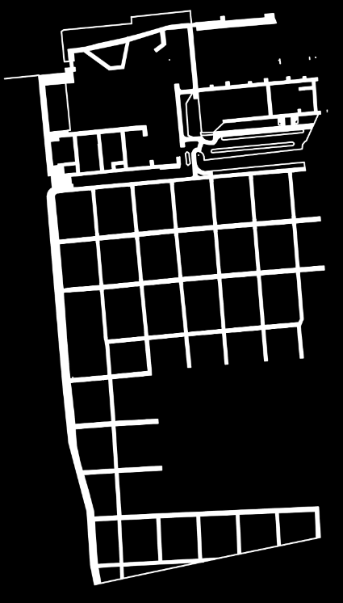
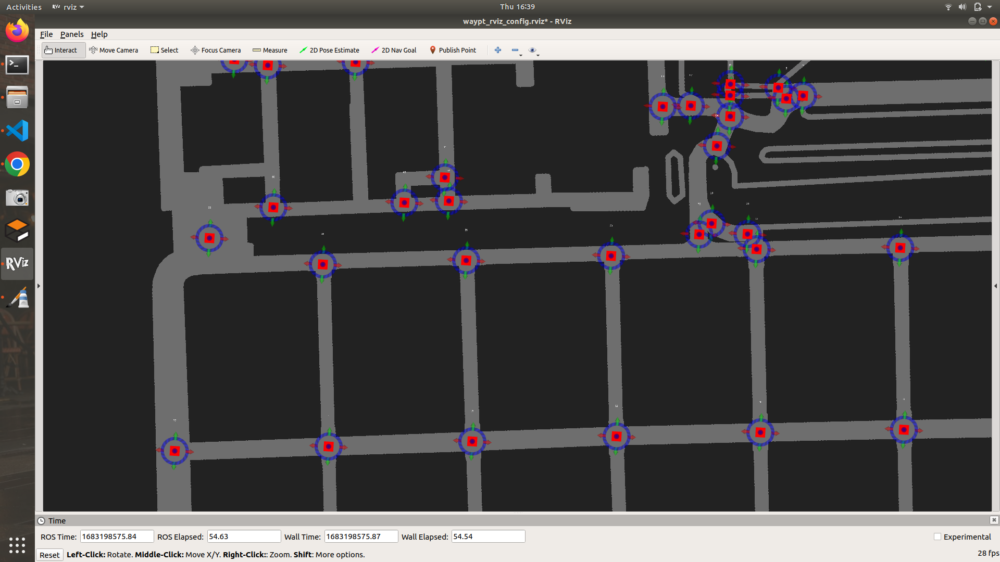
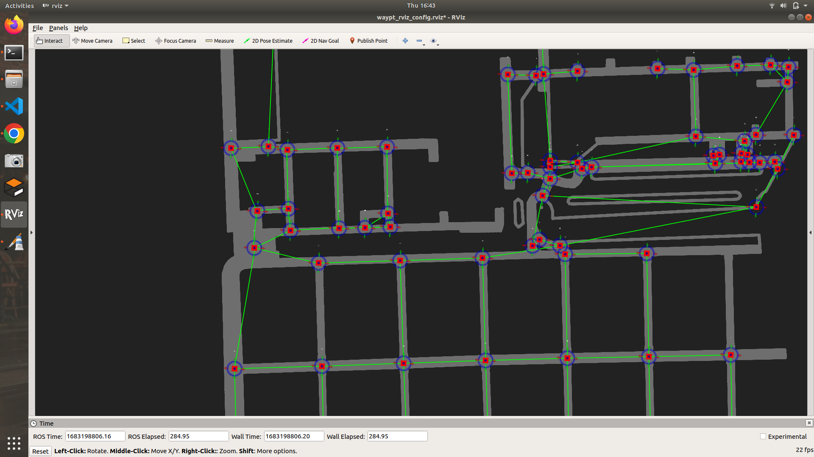
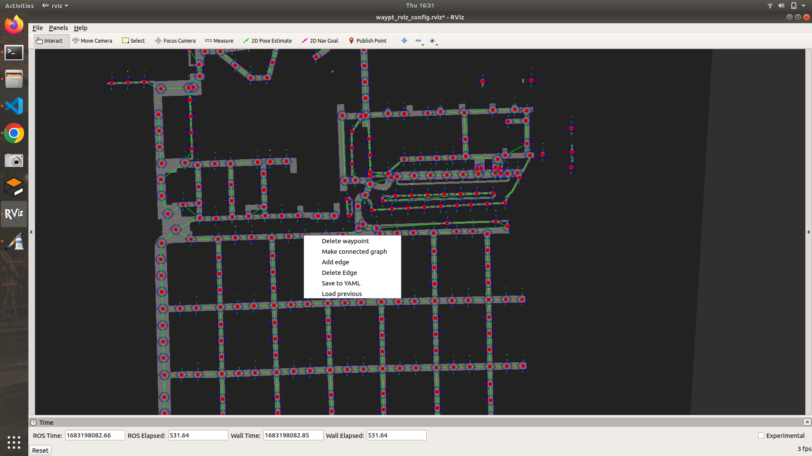

# MAKE CONNECTIVITY GRAPH FROM 2D MAP 

WORKING:
Check the demo.mp4 to get a clear idea of how to use and how it works

ALGORITHM:
First the program finds features such as corners and then puts a black dot on the features and this breaks the roads into segments.
These features are considered as the nodes of the graph.
Next, contours are made around each road segment and extreme points of the contour are found.
Then it loops through the extreme points of road segments, and searches the nearest waypoint to those extreme points. Waypoint closest to one extreme point and the other extreme point of the road segment is connected to each other by an edge.

It also stores the perimeter of the road segment so that when multiple paths are there, scoring can be easily done on the basis of length of the path, number of nodes, least number of turns, etc.


USAGE:
This package detects waypoints from a 2D map and then makes a connectivity graph from it. first open the waypoint folder and then install the required python packages:

1) OpenCV: 3.4.4
2) Numpy: 1.16.6
3) Skimage: 0.14.5

Then, in the input image, make sure that the roads are in white color and the obstacles are in black color as shown in the example image



## STEPS TO USE:

1) In src/skeleton.py specify the path of the map image and then run it. This will convert all the roads to a single pixel wide line.
2) Edit the input image path in src/waypoint.py somewhere around line 977 to include the skeleton image.
3) To run the code:
   1) start roscore
   
        ``` roscore ```
   2) run map_server to publish the map, navigate to waypoint/map_server and run:
   
        ``` rosrun map_server map_server map.yaml ```
    
   3) publish transform to the map:
   
        ``` rosrun tf static_transform_publisher 0 0 0 0 0 0 base_link map 50 ```

   4) run rviz with the waypt_rviz_config.rviz config file
   5) run waypoint.py
   
        ``` python waypoint.py ```

4)  Then after a few seconds, waypoints will be visible in rviz as:
    

5) To add a waypoint publish a point whereever you want to add it, to remove the waypoint rightclick on it and click on delete. You can also move the waypoints by dragging the arrows.
6) Adjust the waypoints properly before making the connected graph.
7) Right click on any of the waypoint and click on "make connected graph" button, this will connect the waypoints to each other and lines will be visible one by one. 
   
8) To delete an edge between two waypoints, rightclick on the first one and select delete edge, then rightclick on the second one and select delete edge.
9)  To make an edge between two waypoints, rightclick on the first and select make edge and rightclick on the second and select make edge, this will create an edge between two waypoints.
10) For the edges which are manually added, the program stores the length of the edge as euclidian distance between the two waypoints. For the edges which were automatically generated, it stores the length of edge as the length of the path that connects the two waypoints.
11) There is no undo button so make changes carefully.
12) After adjusting the edges, rightclick on any waypoint and select save to yaml.
13) This will save three files 
    
    1)connected_graph_high_level.yaml: this is our connectivity graph

    2)edges_high_level: this is to be used when we want to edit our connected_graph_low_level.yaml using this tool.

    3)way_pts_high_level.yaml: this is to be used when we want to edit our connected_graph_low_level.yaml using this tool.

14) When we press the save to yaml for the first time, it will save the above three files to output_yaml folder and then detect the inbetween waypoints in approximately 10 metres apart and then make their connectivity graph and it will be visible on rviz. This will take about a minute.
    
    
   
15) Now edit this and then when you press save to yaml, it will save three new files:
    1) connected_graph_low_level.yaml: this is our connected graph with additional inbetween waypoints.
    2) edges_low_level.yaml: this file is used to edit the connected_graph_low_level.yaml using this tool
    3) way_pts_low_level.yaml: this file is used to edit the connected_graph_low_level.yaml using this tool

16) Now you can quit the program.
    
17) To edit previous work, run everything on step 3, and rightclick on any waypoint and select load previous.
18) In terminal, it will ask for the path to the three yaml files that were saved.
19) Specify the path and then press enter.
20) Depending on the yaml files you choosed (low level or high level), the waypoints and edges will be visible in rviz and you can edit them and press save to yaml. This will save the files as: 
    
    1)connected_graph_edited.yaml

    2)edges_edited.yaml

    3)way_pts_edited.yaml

21) While loading the files make sure you enter the path of way_pts yaml and edge yaml file corresponding to your connected_graph yaml file
22) The format of the saved connected graph yaml will be different from the one required, to change it go to src/convert_format.py change the input yaml path and run the code using:
    ```
    python3 convert_format.py
    ```
23) This will save a converted_graph.yaml in the src folder. 
### CONTACT: ###
Nisarg Panchal, email: nisargnileshpanchal@gmail.com|


